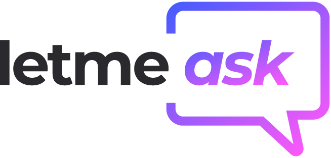
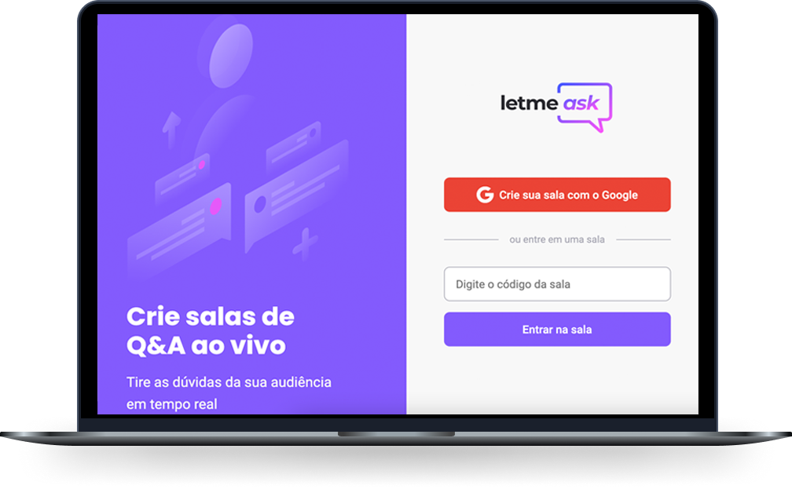

<h1 align="center">
  
</h1>

  <a href="#-tecnologias">Tecnologias</a>&nbsp;&nbsp;&nbsp;|&nbsp;&nbsp;&nbsp;
  <a href="#-projeto">Projeto</a>&nbsp;&nbsp;&nbsp;|&nbsp;&nbsp;&nbsp;
  <a href="#-layout">Layout</a>&nbsp;&nbsp;&nbsp;|&nbsp;&nbsp;&nbsp;
  <a href="#-como-executar">Como executar</a>&nbsp;&nbsp;&nbsp;|&nbsp;&nbsp;&nbsp;

 

  

## ✨ Tecnologias

Esse projeto foi desenvolvido com as seguintes tecnologias:

- [React](https://reactjs.org)
- [Firebase](https://firebase.google.com/)
- [TypeScript](https://www.typescriptlang.org/)

## 💻 Projeto

O letmeask é uma plataforma que possibilita a criação de salas para envio de perguntas. Excelente para ser utilizado em lives, ela conta com o lado do professor e do aluno, garantindo interatividade em tempo real. 

## 🔖 Layout

Você pode visualizar o layout do projeto através [desse link](https://www.figma.com/file/Tl8pgn9eIKlrYs8RvI3CQh/Letmeask). É necessário ter conta no [Figma](http://figma.com/) para acessá-lo.

## 🚀 Como executar

- Clone o repositório
- Instale as dependências com `yarn`
- Inicie o servidor com `yarn dev`

Agora você pode acessar [`localhost:3000`](http://localhost:3000) do seu navegador.

OBS: necessário criação de projeto no Firebase e configuração do arquivo firebase.ts.

---

Feito durante o evento NLW da Rocketseat 👋🏻 [Participe da comunidade!](https://discordapp.com/invite/gCRAFhc)
